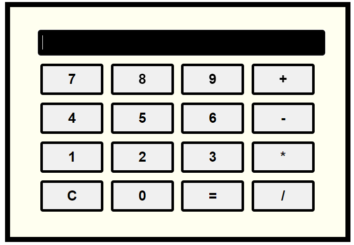

# project-of-simple-calculator

This project is a simple, responsive calculator built using HTML, CSS, and JavaScript. The calculator adjusts its layout and styles to be user-friendly across different screen sizes, making it a perfect example of responsive design.

## Features

- **Responsive Design**: The calculator adjusts its layout and button sizes based on the screen size to provide a consistent user experience on both desktop and mobile devices.
- **Basic Arithmetic Operations**: Supports addition, subtraction, multiplication, and division.
- **Clear Screen Functionality**: Easily clear the input screen with a single button.
- **Dynamic Display**: The result display dynamically updates as buttons are pressed.

## Usage

1. **Display Box**: Shows the input and results of the calculations.
2. **Buttons**: Number buttons (0-9), arithmetic operation buttons (+, -, *, /), a clear button (C), and an equals button (=) for evaluating expressions.

## How to Run

1. Save the HTML, CSS, and JavaScript code into a file (e.g., `index.html`).
2. Open the file in a web browser.

You should now see a responsive calculator that works on both desktop and mobile screens.

## Screenshot

